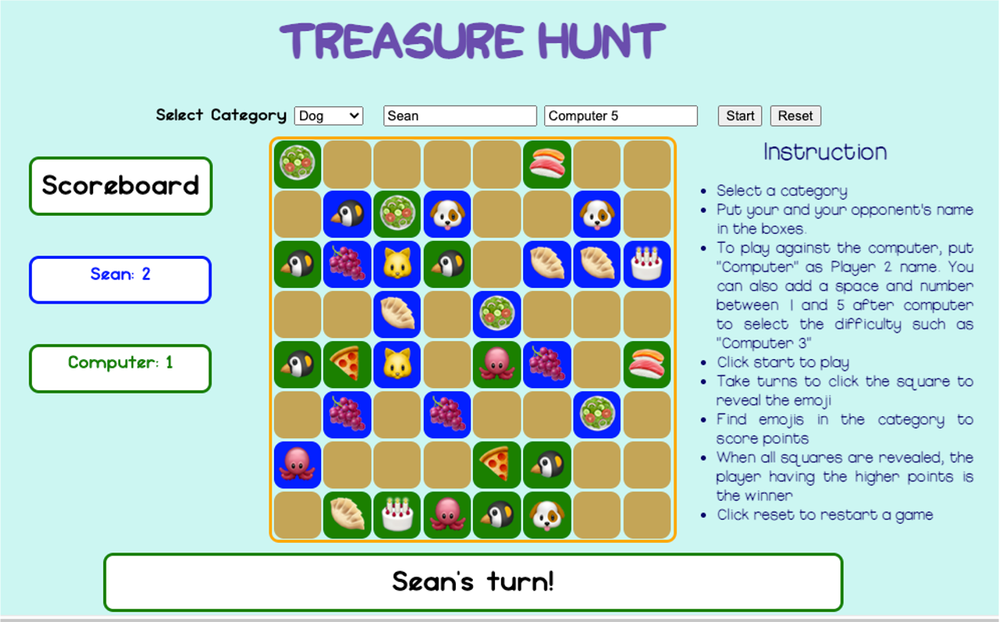

# Treasure Hunt

## About the Game

Two players will compete to see who find more treasures. There are many categories to choose from. Once the category is selected, players have to click on squares alternatively to reveal what's hidden inside. If the item is in the right category, the corresponding player will score one point. When all squares have been revealed, the player with higher scores will be the winner and the game is over.

## Tech Being Use

- HTML
- CSS
- JavaScript (including OOP and DOM)

## Wireframe

## MVP Goals
- Create the game screen layout
- Create a category dropdown menu and the score counting will match the selected category
- Create two objects from a class that matches the input player info
- Display instruction for different categories
- Track each player's score and display them
- Trach each player's move and show whose turn
- Display the winner's name
- Have a clear button that will clear the gameboard, player's info, and displays

## Stretch Goals

- Add a player number dropdown menu to select one player or two players
- Create a computer player when one-player mode is selected
- Add a level dropdwon menu to expand the gameboard
- Add more categories
